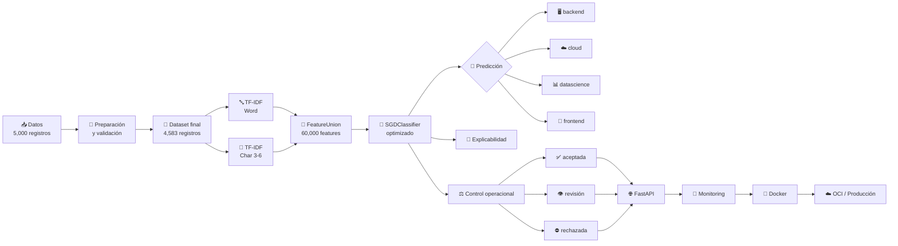
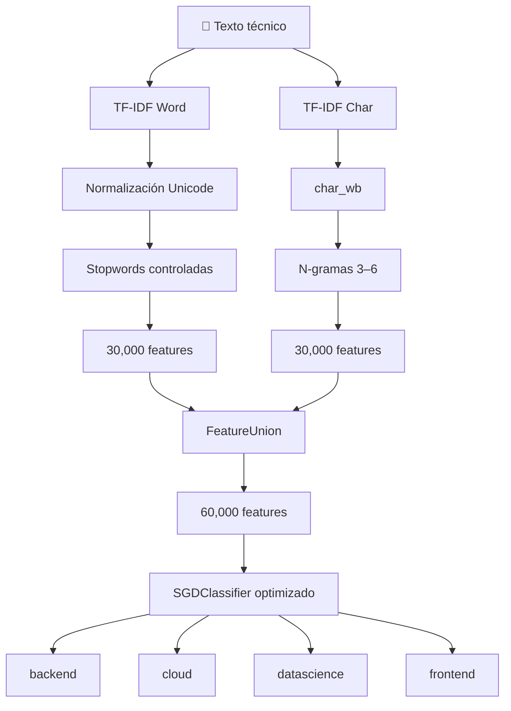

<div align="center">

# 🧠 TechMind

### Clasificación inteligente de contenido técnico con Machine Learning y NLP

[](https://github.com/TU_USUARIO/techmind-v2/releases)
[](https://www.python.org/)
[](https://fastapi.tiangolo.com/)
[](https://scikit-learn.org/)
[](https://www.docker.com/)

[](https://github.com/TU_USUARIO/techmind-v2/actions)
[](LICENSE)
[](#-techmind-v110)
[](#-api-rest)

**Machine Learning · NLP · FastAPI · Docker · Monitoring · OCI**

</div>

---

TechMind es una solución de **Machine Learning y Procesamiento de Lenguaje Natural (NLP)** desarrollada para organizar y clasificar automáticamente contenido tecnológico.

El sistema recibe títulos, publicaciones, artículos o fragmentos de contenido técnico y los clasifica en una de cuatro categorías:

|     Categoría    | Dominio                                                    |
| :--------------: | ---------------------------------------------------------- |
|   🖥️ `backend`  | APIs, Java, Spring, servidores, servicios y bases de datos |
|    ☁️ `cloud`    | AWS, OCI, Azure, Docker, Kubernetes e infraestructura      |
| 📊 `datascience` | Python, Machine Learning, IA y análisis de datos           |
|   🎨 `frontend`  | JavaScript, React, CSS e interfaces web                    |

La solución cubre el ciclo completo de un proyecto de Machine Learning:

**datos → preparación → modelado → evaluación → explicabilidad → API → monitoreo → deployment**

---

# 🔄 Pipeline de TechMind



---

# 🧩 Arquitectura del modelo v1.1.0

La versión actual combina dos representaciones TF-IDF complementarias:



### Arquitectura resumida

```text
                         ┌──────────────────────┐
                         │    TF-IDF Word      │
                         │                      │
                         │ Unicode + Stopwords │
                         │ 30,000 features     │
                         └──────────┬───────────┘
                                    │
                                    ▼
Texto ───────────────────────► FeatureUnion
                                    ▲
                                    │
                         ┌──────────┴───────────┐
                         │    TF-IDF Char      │
                         │                      │
                         │    n-grams 3–6      │
                         │ 30,000 features     │
                         └──────────────────────┘
                                    │
                                    ▼
                             60,000 features
                                    │
                                    ▼
                         SGDClassifier optimizado
                                    │
                                    ▼
                 ┌──────────┬───────────┬─────────────┐
                 ▼          ▼           ▼             ▼
              backend     cloud    datascience     frontend
```

---

# 📌 Estado del proyecto

| Componente                      | Estado |
| ------------------------------- | :----: |
| Dataset procesado               |    ✅   |
| Pipeline de preparación         |    ✅   |
| Modelo v1.0.0                   |    ✅   |
| **Modelo v1.1.0**               |    ✅   |
| Evaluación sobre test reservado |    ✅   |
| Explicabilidad                  |    ✅   |
| Robustez                        |    ✅   |
| Calibración operacional         |    ✅   |
| Predictor productivo            |    ✅   |
| FastAPI                         |    ✅   |
| Smoke Tests                     |    ✅   |
| Monitoreo                       |    ✅   |
| Docker                          |    ✅   |
| Preparación para OCI            |    ✅   |
| Documentación                   |    ✅   |

### Versiones actuales

```text
Package:       1.1.0
Model:         1.1.0
API interface: 1.0.0
```

> **Nota:** la interfaz REST permanece en `1.0.0` para mantener compatibilidad con las integraciones desarrolladas para la versión anterior.

---

# 📊 Resultados principales

| Métrica         | v1.0.0 | **v1.1.0** |
| --------------- | -----: | ---------: |
| F1 Macro Test   | 0.8401 | **0.8441** |
| Accuracy Test   | 0.8386 | **0.8430** |
| Precision Macro | 0.8445 | **0.8455** |
| Recall Macro    | 0.8385 | **0.8434** |
| F1 Weighted     | 0.8397 | **0.8435** |

### Rendimiento operacional v1.1.0

| Métrica                            |  Resultado |
| ---------------------------------- | ---------: |
| F1 Macro CV                        | **0.8493** |
| F1 Macro Test                      | **0.8441** |
| Accuracy de predicciones aceptadas | **95.08%** |
| Tasa revisión/rechazo              | **26.83%** |
| Captura de errores                 | **77.08%** |
| Casos externos correctos           |    **9/9** |
| Casos externos sin cobertura       |      **0** |

---

# 🎯 Objetivo

El objetivo principal de TechMind es construir un sistema capaz de:

* clasificar contenido técnico automáticamente;
* identificar la categoría tecnológica predominante;
* reducir el trabajo manual de organización;
* detectar predicciones ambiguas;
* identificar entradas con baja cobertura;
* proporcionar explicaciones sobre las decisiones del modelo;
* permitir revisión humana cuando sea necesario;
* exponer el modelo mediante una API REST;
* monitorear cambios en los datos y comportamiento del modelo;
* facilitar su integración con aplicaciones externas.

---

# 🗂️ Categorías

TechMind trabaja actualmente con cuatro clases:

| Categoría     | Descripción                                                                      |
| ------------- | -------------------------------------------------------------------------------- |
| `backend`     | APIs, Java, Spring, servidores, bases de datos, servicios y arquitectura backend |
| `cloud`       | AWS, OCI, Azure, Kubernetes, Docker, infraestructura y servicios cloud           |
| `datascience` | Python, Machine Learning, análisis de datos, IA y modelos predictivos            |
| `frontend`    | JavaScript, React, CSS, interfaces y desarrollo web frontend                     |

---

# 📊 Dataset

El dataset original utilizado durante el desarrollo contiene aproximadamente:

```text
5,000 registros
4 categorías
```

Las clases originalmente se encontraban distribuidas de forma balanceada.

Durante el pipeline de calidad se realizaron, entre otras, las siguientes operaciones:

* normalización textual;
* limpieza de títulos y contenido;
* detección de documentos vacíos;
* identificación de categorías contradictorias;
* resolución de conflictos;
* detección de duplicados;
* eliminación de registros duplicados;
* ingeniería de características;
* validación integral;
* generación de variantes textuales.

Después del proceso de preparación:

```text
Registros finales: 4,583
Clases: 4
Balance ratio: 0.946
Documentos vacíos: 0
Nulos críticos: 0
Infinitos: 0
Duplicados textuales residuales: 0
Categorías contradictorias residuales: 0
```

---

# 🔬 Evolución del modelo

## v1.0.0

La primera versión productiva utilizó:

```text
TF-IDF Word
      │
      ▼
SGDClassifier optimizado
```

El modelo final utilizó hasta:

```text
30,000 características TF-IDF
```

### Resultados v1.0.0

| Métrica         |  Resultado |
| --------------- | ---------: |
| Accuracy        |     0.8386 |
| Precision Macro |     0.8445 |
| Recall Macro    |     0.8385 |
| F1 Macro        | **0.8401** |
| F1 Weighted     |     0.8397 |

Esta versión demostró una buena capacidad de generalización, pero durante las pruebas de integración se detectó una limitación importante en algunos textos técnicos cortos.

Por ejemplo, contenido relacionado con:

```text
Spring Boot
Java
API REST
controladores
servicios
repositorios
```

podía presentar cobertura limitada en el vocabulario Word y generar clasificaciones incorrectas.

Este comportamiento motivó el desarrollo de **TechMind v1.1.0**.

---

# 🚀 TechMind v1.1.0

La nueva versión incorpora una arquitectura híbrida basada en palabras y caracteres.

```text
                         ┌──────────────────────┐
                         │   TF-IDF Word       │
                         │                      │
Texto ──────────────────►│ Unicode + Stopwords │
                         │ 30,000 features      │
                         └──────────┬───────────┘
                                    │
                                    │
                                    ▼
                              FeatureUnion
                                    │
                                    ▲
                                    │
                         ┌──────────┴───────────┐
                         │   TF-IDF Char       │
Texto ──────────────────►│   n-grams 3–6      │
                         │ 30,000 features      │
                         └──────────────────────┘
                                    │
                                    ▼
                         SGDClassifier optimizado
                                    │
                                    ▼
                 backend / cloud / datascience / frontend
```

## Características principales

### Rama Word

Incluye:

* normalización Unicode;
* eliminación controlada de stopwords en español;
* n-gramas de palabras;
* vocabulario técnico;
* hasta `30,000` características.

### Rama Char

Incluye:

```text
char n-grams: 3–6
```

y hasta:

```text
30,000 características
```

Esto permite reconocer patrones como:

```text
spring
api
java
kubernetes
react
python
docker
```

incluso cuando la representación completa por palabras tiene poca cobertura.

### Total

```text
Word features: 30,000
Char features: 30,000
Total:         60,000
```

---

# 📈 Resultados v1.1.0

La versión final fue evaluada sobre un conjunto de test reservado de **917 documentos**.

| Métrica              |   Resultado |
| -------------------- | ----------: |
| F1 Macro CV          |  **0.8493** |
| F1 Macro Test        |  **0.8441** |
| Accuracy Test        |  **0.8430** |
| Precision Macro      |  **0.8455** |
| Recall Macro         |  **0.8434** |
| F1 Weighted          |  **0.8435** |
| Diferencia Test − CV | **-0.0052** |

La diferencia entre validación cruzada y test reservado indica una generalización consistente.

### Rendimiento operacional

| Métrica                                        |  Resultado |
| ---------------------------------------------- | ---------: |
| Accuracy de predicciones aceptadas             | **95.08%** |
| Tasa revisión/rechazo                          | **26.83%** |
| Captura de errores                             | **77.08%** |
| Documentos externos correctamente clasificados |    **9/9** |
| Casos externos sin cobertura                   |      **0** |

Comparación:

```text
F1 Macro Test v1.0.0: 0.8401
F1 Macro Test v1.1.0: 0.8441
Mejora absoluta:      +0.0040
```

---

# 🧪 Calibración operacional

TechMind no se limita a devolver una categoría.

El sistema determina también si la predicción puede utilizarse automáticamente.

Los posibles estados son:

```text
aceptada
revision
rechazada
```

## `aceptada`

La predicción posee suficiente evidencia para ser utilizada automáticamente.

```json
{
  "estado": "aceptada",
  "requiere_revision": false,
  "prediccion_utilizable": true
}
```

## `revision`

Existe una clasificación, pero el sistema recomienda revisión humana.

```json
{
  "estado": "revision",
  "requiere_revision": true,
  "prediccion_utilizable": true
}
```

## `rechazada`

La entrada no presenta suficiente cobertura para utilizar la predicción.

```json
{
  "estado": "rechazada",
  "prediccion_utilizable": false
}
```

Los umbrales operacionales fueron calibrados utilizando predicciones **Out-of-Fold de 5 folds** sobre el conjunto de entrenamiento.

---

# 🔎 Cobertura Word + Char

En v1.1.0 la cobertura ya no depende exclusivamente del vocabulario de palabras.

Se calcula como:

```text
features_activas_total =
word_features_activas
+
char_features_activas
```

Por ejemplo:

```text
word_features_activas = 0
char_features_activas = 215
features_activas_total = 215
```

continúa siendo una entrada válida.

Por compatibilidad con v1.0.0, el campo:

```text
terminos_activos
```

se mantiene como alias del total de características activas.

---

# ⚠️ Scores y probabilidades

Los valores:

```text
puntuacion_ganadora
puntuacion_segunda
margen_decision
```

son **scores del clasificador**, no probabilidades.

Por esta razón la API devuelve:

```json
{
  "margin_is_probability": false
}
```

Un margen de:

```text
0.98
```

no debe interpretarse como:

```text
98%
```

---

# 🔍 Explicabilidad

TechMind permite solicitar información sobre las características que influyeron en una predicción.

La respuesta puede incluir:

```text
positive_terms
negative_terms
differential_terms
```

En v1.1.0 se incluye también:

```text
feature_type
```

para identificar si una característica proviene de:

```text
word
```

o:

```text
char
```

Ejemplo:

```json
{
  "term": "spring",
  "feature_type": "char",
  "tfidf": 0.0759,
  "coefficient": 0.4744,
  "contribution": 0.0360
}
```

Las contribuciones describen el comportamiento matemático del modelo y **no representan causalidad**.

---

# 🧱 Estructura del proyecto

```text
techmind-v2/
│
├── .github/
│   └── workflows/
│       └── ci.yml
│
├── artifacts/
│   ├── v1.0.0/
│   └── v1.1.0/
│
├── data/
│   ├── raw/
│   ├── audit/
│   └── processed/
│
├── deployment/
│
├── docs/
│   ├── versions/
│   │   ├── v1.0.0/
│   │   └── v1.1.0/
│   └── images/
│
├── examples/
│
├── monitoring/
│   ├── config/
│   ├── batches/
│   └── logs/
│
├── notebooks/
│   ├── 01_eda_preparacion_datos.ipynb
│   ├── 02_variantes_textuales_splits.ipynb
│   ├── 03_modelado_seleccion.ipynb
│   ├── 04_evaluacion_explicabilidad_empaquetado.ipynb
│   └── 05_modelo_v1.1.0/
│
├── reports/
│   ├── evaluation/
│   ├── explainability/
│   ├── robustness/
│   ├── monitoring/
│   ├── deployment/
│   ├── final/
│   └── versions/
│
├── models/
│   ├── v1.0.0/
│   └── v1.1.0/
│
├── techmind/
│   ├── __init__.py
│   └── predictor.py
│
├── techmind_api/
│   ├── __init__.py
│   ├── main.py
│   └── schemas.py
│
├── tests/
│
├── Dockerfile
├── docker-compose.yml
├── pyproject.toml
├── requirements.txt
├── run_api.py
├── CHANGELOG.md
├── VERSION
└── README.md
```

---

# 📓 Notebooks

El desarrollo del proyecto se encuentra organizado en las siguientes etapas:

### 01 — EDA y preparación de datos

```text
01_eda_preparacion_datos.ipynb
```

Incluye:

* análisis exploratorio;
* distribución de categorías;
* calidad textual;
* duplicados;
* conflictos;
* normalización;
* ingeniería de características.

---

### 02 — Variantes textuales y splits

```text
02_variantes_textuales_splits.ipynb
```

Se desarrollaron variantes como:

```text
texto_modelo_base
texto_modelo_titulo
texto_combinado
texto_combinado_ponderado
```

y se generaron los conjuntos:

```text
Train: 3,666
Test:    917
```

---

### 03 — Modelado y selección

```text
03_modelado_seleccion.ipynb
```

Se compararon diferentes algoritmos y configuraciones.

Entre ellos:

* Logistic Regression;
* LinearSVC;
* SGDClassifier.

La mejor configuración de v1.0.0 fue:

```text
TF-IDF + SGDClassifier optimizado
```

---

### 04 — Evaluación, explicabilidad y empaquetado

```text
04_evaluacion_explicabilidad_empaquetado.ipynb
```

Incluye:

* evaluación final;
* matriz de confusión;
* análisis de errores;
* explicabilidad;
* pruebas de robustez;
* creación del predictor;
* empaquetado;
* API;
* monitoring;
* deployment.

---

### 05 — Modelo v1.1.0

La evolución del modelo se documenta mediante:

```text
05_modelo_v1.1.0/
```

incluyendo:

```text
05_01_diagnostico_v1.0.0.ipynb
05_02_word_char_experimentos.ipynb
05_03_calibracion_operacional.ipynb
05_04_evaluacion_final_v1.1.0.ipynb
05_05_empaquetado_api_v1.1.0.ipynb
```

---

# ⚙️ Instalación

## 1. Clonar el repositorio

```bash
git clone <[http](https://github.com/MaferVelde/TechMind/)>
cd techmind-v2
```

## 2. Crear entorno virtual

```bash
python -m venv .venv
```

Windows:

```bash
.venv\Scripts\activate
```

Linux/macOS:

```bash
source .venv/bin/activate
```

## 3. Instalar dependencias

```bash
pip install --upgrade pip
pip install -r requirements.txt
```

Para desarrollo:

```bash
pip install -e .
```

---

# 🤖 Uso del predictor

```python
from techmind import TechMindPredictor

predictor = TechMindPredictor()

resultado = predictor.predict(
    [
        "Este contenido explica cómo crear una API REST "
        "con Spring Boot y Java."
    ],
    include_explanation=True,
    explanation_top_n=8,
    top_k=4,
)

print(resultado)
```

---

# 🌐 API REST

TechMind utiliza **FastAPI** para exponer el modelo.

Ejecutar:

```bash
python run_api.py
```

o:

```bash
uvicorn techmind_api.main:app \
    --host 0.0.0.0 \
    --port 8000
```

Documentación Swagger:

```text
http://localhost:8000/docs
```

ReDoc:

```text
http://localhost:8000/redoc
```

---

# 🔌 Endpoints

```text
GET  /
GET  /health
GET  /model-info
POST /predict
GET  /docs
GET  /redoc
GET  /openapi.json
```

---

# 💻 Ejemplo de API

## Request

```json
{
  "textos": [
    "Este contenido explica cómo crear una API REST con Spring Boot y Java, incluyendo el uso de controladores, servicios y repositorios."
  ],
  "incluir_explicacion": true,
  "top_n_explicacion": 8,
  "top_k": 4
}
```

Resultado esperado del caso de regresión:

```text
categoria_predicha: backend
estado: aceptada

word_features_activas: 0
char_features_activas: 215
features_activas_total: 215

prediccion_utilizable: true
```

---

# ❤️ Health Check

Antes de enviar tráfico a la API:

```http
GET /health
```

debe devolver:

```json
{
  "status": "ok",
  "ready": true,
  "api_version": "1.0.0",
  "model_version": "1.1.0"
}
```

La aplicación debe enviar tráfico a `/predict` únicamente cuando:

```text
ready = true
```

---

# 🐳 Docker

Construir:

```bash
docker build \
    -t techmind-api:1.1.0 \
    .
```

Ejecutar:

```bash
docker run \
    --rm \
    -p 8000:8000 \
    techmind-api:1.1.0
```

También puede utilizarse:

```bash
docker compose up --build
```

---

# ☁️ Deployment

El proyecto incluye configuración para despliegue y health checks.

La estructura incluye:

```text
deployment/
├── deployment_config.json
├── healthcheck.py
└── oci/
```

TechMind fue preparado para ejecutarse sobre infraestructura de **Oracle Cloud Infrastructure (OCI)**.

---

# 📡 Monitoreo

El proyecto incluye una capa de monitoring para detectar cambios en producción.

Se supervisan aspectos como:

* distribución de categorías;
* tasa de predicciones aceptadas;
* tasa de revisión;
* tasa de rechazo;
* cobertura;
* margen de decisión;
* drift;
* comportamiento por lotes.

La configuración se encuentra en:

```text
monitoring/config/
```

y los resultados se generan en:

```text
reports/monitoring/
```

---

# ✅ Tests

Ejecutar:

```bash
pytest -q
```

El proyecto incluye pruebas para:

```text
predictor
API
smoke test
monitoring
regresión
compatibilidad
```

Entre las pruebas de regresión se encuentra específicamente el caso:

```text
Spring Boot + Java + API REST
```

que motivó el desarrollo de v1.1.0.

---

# 🔐 Integridad del modelo

El artefacto final v1.1.0 posee SHA-256:

```text
756b2577e731336ead95852ee1d8d752408762478a23d0bbf42cc9537e136ff6
```

El hash permite verificar que el modelo utilizado en producción corresponde exactamente al artefacto evaluado.

---

# 📦 Versionado

TechMind conserva las diferentes versiones productivas.

```text
artifacts/
├── v1.0.0/
└── v1.1.0/
```

También:

```text
releases/
├── v1.0.0/
└── v1.1.0/
```

La raíz del repositorio representa siempre la versión estable actual.

Actualmente:

```text
Package:       1.1.0
Model:         1.1.0
API interface: 1.0.0
```

---

# 📝 Changelog

## v1.1.0

### Added

* TF-IDF Word + Char;
* char n-grams 3–6;
* stopwords controladas;
* normalización Unicode;
* 60,000 features;
* calibración OOF;
* nuevas métricas de cobertura;
* `word_features_activas`;
* `char_features_activas`;
* `features_activas_total`;
* `feature_type` en explicaciones;
* pruebas de regresión;
* actualización del predictor;
* actualización de FastAPI;
* compatibilidad con API 1.0.0.

### Fixed

* clasificación incorrecta de textos técnicos cortos relacionados con Spring Boot y APIs REST;
* dependencia excesiva de stopwords;
* interpretación incorrecta de cobertura cuando Word TF-IDF no encontraba términos.

---

## v1.0.0

Primera versión productiva de TechMind.

Incluyó:

* TF-IDF;
* SGDClassifier;
* predictor productivo;
* FastAPI;
* explicabilidad;
* robustez;
* monitoring;
* Docker;
* deployment.

---

# 🛠️ Tecnologías

El proyecto utiliza principalmente:

```text
Python
Pandas
NumPy
Scikit-learn
SciPy
Joblib
FastAPI
Pydantic
Uvicorn
Pytest
Docker
GitHub Actions
Oracle Cloud Infrastructure
```

---

# 📚 Documentación

La documentación adicional se encuentra en:

```text
docs/
```

Incluyendo:

```text
architecture.md
data_dictionary.md
model_card.md
api_reference.md
monitoring.md
```

además de documentación específica por versión.

---

# ⚠️ Limitaciones

TechMind debe utilizarse considerando las siguientes limitaciones:

* el modelo está especializado en las cuatro categorías disponibles;
* no debe interpretarse el margen de decisión como probabilidad;
* contenido extremadamente breve puede requerir revisión;
* contenido multidisciplinario puede presentar ambigüedad;
* nuevas tecnologías pueden producir drift con el tiempo;
* las explicaciones representan asociaciones matemáticas y no causalidad.

Por esta razón el sistema combina clasificación automática, control operacional y monitoreo.

---

# 🔮 Próximos pasos

Entre las posibles mejoras futuras se encuentran:

* ampliar el número de categorías;
* incorporar más contenido técnico;
* evaluar modelos basados en embeddings;
* comparar con modelos Transformer;
* implementar detección automática de nuevos temas;
* mejorar monitoreo de drift semántico;
* automatizar reentrenamiento;
* incorporar feedback humano;
* mejorar observabilidad en producción.

---

# 🤝 Contribuciones

Las contribuciones al proyecto deben realizarse mediante branches y Pull Requests.

Antes de enviar cambios:

```bash
pytest -q
```

y verificar que no se modifique un artefacto de modelo aprobado sin incrementar la versión correspondiente.

Consulta:

```text
CONTRIBUTING.md
```

---

# 📄 Licencia

Consulta el archivo:

```text
LICENSE
```

para conocer los términos de uso del proyecto.

---

# 🧠 TechMind

```text
Datos
  ↓
Preparación
  ↓
NLP
  ↓
Machine Learning
  ↓
Evaluación
  ↓
Explicabilidad
  ↓
Control operacional
  ↓
API
  ↓
Monitoring
  ↓
Deployment
```

**TechMind v1.1.0 — clasificación inteligente de contenido técnico con Machine Learning y NLP.**
