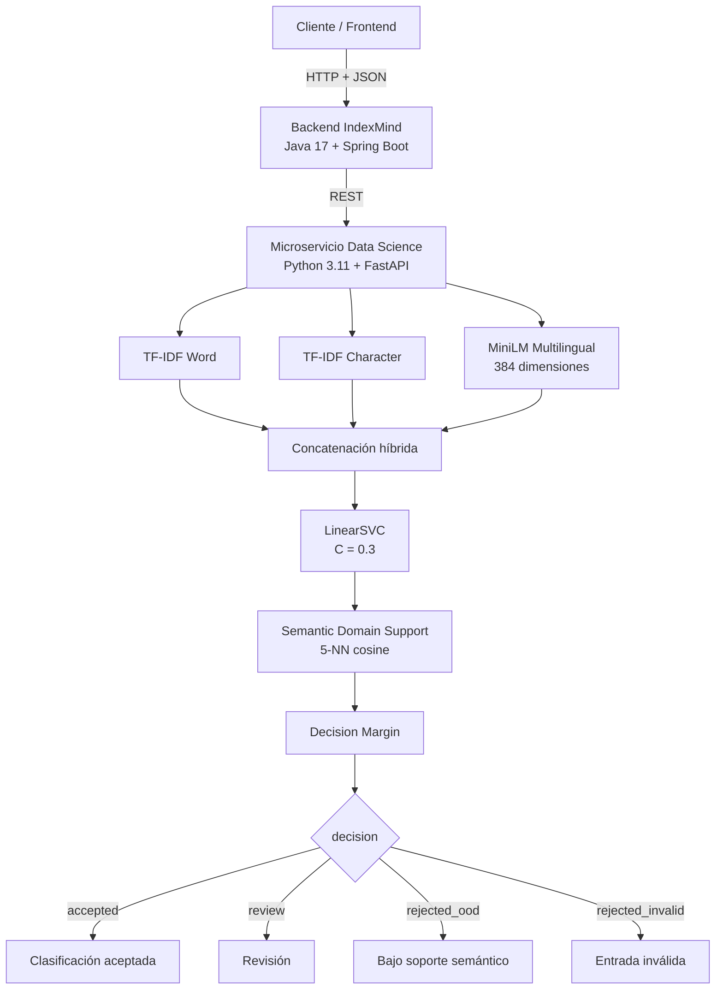

# 🚀 IndexMind

### Clasificación inteligente y multilingual de contenido técnico con Machine Learning y NLP

**Java 17 · Spring Boot · Python 3.11 · FastAPI · Scikit-Learn · Sentence Transformers · Docker**

[](#-versión-actual)
[](#-versión-actual)
[](#-historial-y-evolución-del-modelo)
[](#-deployment)
[](#-api-del-modelo)

---

## 🌐 Proyecto en línea

- **Sitio web:** https://indexmind.tech/
- **Swagger / Backend:** http://techmind-g9.duckdns.org:8080/swagger-ui.html
- **Video del proyecto:** https://youtu.be/SVoUxwqGgHk?si=PsR6FFC_BFSAABB3

---

# 🧠 ¿Qué es IndexMind?

**IndexMind** es una solución orientada a organizar y clasificar automáticamente contenido técnico mediante Machine Learning y Procesamiento de Lenguaje Natural.

El sistema recibe títulos, publicaciones, artículos o fragmentos de contenido y los clasifica en una de cuatro categorías:

| Categoría | Dominio |
|---|---|
| 🖥️ `backend` | APIs, Java, Spring, servicios, servidores y lógica backend |
| ☁️ `cloud` | AWS, OCI, Azure, Docker, Kubernetes e infraestructura |
| 📊 `datascience` | Python, Machine Learning, IA, NLP y análisis de datos |
| 🎨 `frontend` | JavaScript, React, CSS, interfaces y desarrollo web |

La versión más reciente incorpora capacidad **multilingual** evaluada en:

```text
Español
Inglés
Ruso
Español + Inglés
```

---

# 🎯 Problema

El crecimiento constante del contenido técnico hace cada vez más difícil:

- localizar información relevante;
- organizar repositorios de conocimiento;
- reutilizar recursos técnicos;
- mantener una clasificación consistente;
- trabajar con contenido en varios idiomas;
- decidir cuándo una clasificación automática es suficientemente confiable.

IndexMind busca convertir información técnica dispersa en conocimiento estructurado y reutilizable.

---

# 💡 Solución

IndexMind combina:

```text
clasificación automática
+
representación léxica
+
representación semántica multilingual
+
controles operativos
+
API REST
+
deployment Docker
```

La solución no se limita a devolver una categoría.

También evalúa si la predicción debe:

```text
accepted
review
rejected_ood
rejected_invalid
```

---

# 🧱 Arquitectura general



---

# 🔄 Historial y evolución del modelo

IndexMind conserva las versiones anteriores para mantener trazabilidad técnica y mostrar la evolución del proyecto.

## v1.0.0 — Primera versión productiva

La primera versión utilizó:

```text
TF-IDF Word
      ↓
SGDClassifier optimizado
```

Características principales:

- TF-IDF basado en palabras;
- hasta 30,000 características;
- predictor productivo;
- FastAPI;
- explicabilidad;
- pruebas de robustez;
- monitoreo;
- Docker;
- preparación para deployment.

### Resultados v1.0.0

| Métrica | Resultado |
|---|---:|
| Accuracy | 0.8386 |
| Precision Macro | 0.8445 |
| Recall Macro | 0.8385 |
| F1 Macro | 0.8401 |
| F1 Weighted | 0.8397 |

### Limitación detectada

Durante integración se observaron dificultades con algunos textos técnicos cortos, especialmente cuando el vocabulario completo por palabras tenía poca cobertura.

Ejemplos:

```text
Spring Boot
Java
API REST
controladores
servicios
repositorios
```

Este comportamiento motivó el desarrollo de v1.1.0.

---

## v1.1.0 — Word + Character TF-IDF

v1.1 amplió la representación léxica mediante dos ramas:

```text
                         ┌──────────────────────┐
                         │    TF-IDF Word      │
Texto ─────────────────►│ Unicode + Stopwords │
                         │ 30,000 features     │
                         └──────────┬───────────┘
                                    │
                                    ▼
                              FeatureUnion
                                    ▲
                                    │
                         ┌──────────┴───────────┐
                         │    TF-IDF Char      │
                         │    n-grams 3–6      │
                         │ 30,000 features     │
                         └──────────────────────┘
                                    │
                                    ▼
                              60,000 features
                                    │
                                    ▼
                           SGDClassifier
```

### Mejoras de v1.1

- normalización Unicode;
- stopwords controladas;
- TF-IDF Word;
- TF-IDF Character;
- char n-grams 3–6;
- mejor cobertura en textos técnicos cortos;
- calibración operacional;
- explicabilidad Word/Char;
- mantenimiento de compatibilidad con la API anterior.

### Resultados v1.1.0

| Métrica | Resultado |
|---|---:|
| F1 Macro CV | 0.8493 |
| F1 Macro Test | 0.8441 |
| Accuracy Test | 0.8430 |
| Precision Macro | 0.8455 |
| Recall Macro | 0.8434 |
| F1 Weighted | 0.8435 |

### Rendimiento operacional v1.1

| Métrica | Resultado |
|---|---:|
| Accuracy de predicciones aceptadas | 95.08% |
| Tasa revisión/rechazo | 26.83% |
| Captura de errores | 77.08% |
| Casos externos correctos | 9/9 |
| Casos externos sin cobertura | 0 |

### Integridad v1.1

SHA-256:

```text
756b2577e731336ead95852ee1d8d752408762478a23d0bbf42cc9537e136ff6
```

> **v1.1.0 se conserva como baseline estable y fallback.**

---

## v1.2.0-multilingual — Arquitectura híbrida léxica + semántica

La versión v1.2 amplía el proyecto hacia clasificación multilingual.

Estado:

```text
validated_experimental_candidate
```

Arquitectura:

```text
Texto
 │
 ├── TF-IDF Word
 ├── TF-IDF Character
 └── MiniLM Multilingual (384)
          │
          ▼
     Concatenación
          │
          ▼
      LinearSVC
        C = 0.3
          │
          ▼
 Semantic Domain Support
          │
          ▼
    Decision Margin
          │
          ▼
 accepted / review /
 rejected_ood / rejected_invalid
```

Modelo de embeddings:

```text
sentence-transformers/paraphrase-multilingual-MiniLM-L12-v2
```

Dimensión:

```text
384
```

Clasificador:

```text
LinearSVC
C = 0.3
```

Espacio total:

```text
60,384 características
```

---

# 📌 Versión actual

| Componente | Versión / estado |
|---|---|
| Solución | IndexMind |
| Modelo estable de fallback | `v1.1.0` |
| Modelo multilingual | `v1.2.0-multilingual` |
| Estado v1.2 | `validated_experimental_candidate` |
| API del modelo v1.2 | `1.2.0` |
| Clasificador | `LinearSVC` |
| C | `0.3` |
| Embeddings | MiniLM multilingual |
| Dimensión semántica | `384` |

> v1.2 es la evolución más reciente del proyecto, mientras que v1.1 permanece disponible como baseline estable y mecanismo de rollback.

---

# 🌐 Soporte multilingual

La versión v1.2 fue evaluada en:

| Código | Idioma |
|---|---|
| `en` | Inglés |
| `es` | Español |
| `ru` | Ruso |
| `es_en` | Español + Inglés |

La misma taxonomía se conserva en todos los idiomas:

```text
backend
cloud
datascience
frontend
```

---

# 🛡️ Controles operativos v1.2

## 1. Semantic Domain Support

El embedding de cada entrada se compara con referencias semánticas del dominio técnico mediante:

```text
NearestNeighbors
n_neighbors = 5
metric = cosine
```

Métrica:

```text
domain_similarity_5nn
```

Threshold congelado:

```text
0.4266
```

---

## 2. Decision Margin

Se calcula:

```text
decision_margin = score_top1 - score_top2
```

Threshold:

```text
0.8132
```

---

## Regla operacional

```text
Entrada válida?
  ├── No → rejected_invalid
  └── Sí
       ↓
domain_similarity_5nn >= 0.4266?
  ├── No → rejected_ood
  └── Sí
       ↓
decision_margin >= 0.8132?
  ├── No → review
  └── Sí → accepted
```

Backend debe utilizar:

```text
decision
```

como autoridad operacional.

---

# ⚠️ Scores y probabilidades

El clasificador final utiliza `LinearSVC`.

Por lo tanto:

```text
score_top1
score_top2
decision_margin
```

son **scores de decisión**, no probabilidades calibradas.

Un valor como:

```text
1.58
```

no significa:

```text
158% de confianza
```

La API no debe presentar estos valores bajo nombres como `probabilidad`.

---

# 🧪 Evaluación v1.2

## Test original

Conjunto:

```text
917 documentos
```

| Métrica | Resultado |
|---|---:|
| Accuracy | **0.8746** |
| Precision Macro | **0.8763** |
| Recall Macro | **0.8749** |
| F1 Macro | **0.8753** |
| F1 Weighted | **0.8749** |

---

# 🌍 Benchmark multilingual final independiente

Después de congelar arquitectura, hiperparámetros y thresholds, v1.2 fue evaluado sobre un benchmark independiente.

Diseño:

```text
320 documentos
80 casos semánticos
4 idiomas
4 categorías
```

Resultado global:

```text
244 / 320 correctos
```

| Métrica | Resultado |
|---|---:|
| Accuracy | **0.7625** |
| Precision Macro | **0.8167** |
| Recall Macro | **0.7625** |
| F1 Macro | **0.7570** |
| F1 Weighted | **0.7570** |

---

## Rendimiento por idioma

| Idioma | Accuracy |
|---|---:|
| Inglés | **0.7750** |
| Español | **0.7500** |
| Español/Inglés | **0.7875** |
| Ruso | **0.7375** |

---

## Rendimiento por categoría

| Categoría | Accuracy |
|---|---:|
| Backend | **0.9000** |
| Cloud | **0.4000** |
| Data Science | **0.8375** |
| Frontend | **0.9125** |

---

# 📊 Evolución multilingual v1.1 → v1.2

Evaluados sobre el mismo benchmark final:

| Modelo | Accuracy | F1 Macro |
|---|---:|---:|
| v1.1 | 0.5656 | 0.5705 |
| v1.2 multilingual | **0.7625** | **0.7570** |

Mejora absoluta en Accuracy:

```text
+0.1969
≈ +19.69 puntos porcentuales
```

Mejora absoluta en F1 Macro:

```text
+0.1864
```

---

# 🚦 Rendimiento operacional final

Aplicando simultáneamente Semantic Domain Support y Decision Margin:

| Estado / métrica | Resultado |
|---|---:|
| Accepted | 120 |
| Review | 160 |
| Rejected OOD | 40 |
| Coverage | **37.50%** |
| Accepted Accuracy | **91.67%** |
| Error Capture | **86.84%** |
| Accepted Errors | 10 |

Esto permite operar de forma conservadora y reducir la aceptación automática de predicciones incorrectas.

---

# ⚠️ Limitación conocida: Cloud ↔ Backend

La principal limitación identificada corresponde a la categoría:

```text
cloud
```

Accuracy:

```text
0.4000
```

Entre los 80 ejemplos Cloud del benchmark final:

```text
Predicho backend      42
Predicho cloud        32
Predicho datascience   6
```

La principal confusión es:

```text
cloud → backend
```

Esta limitación se asocia principalmente a:

- frontera conceptual entre ambas categorías;
- cobertura del corpus;
- contenido Cloud con fuerte componente backend.

No debe corregirse mediante reglas manuales como:

```text
si contiene "AWS" → cloud
si contiene "Docker" → cloud
si contiene "API" → backend
```

Una futura v1.3 deberá abordar este problema mediante nuevos datos, entrenamiento y validación independiente.

---

# 🧪 Dataset y preparación

Dataset original:

```text
5,000 registros
1,250 por clase
```

Después del proceso de validación y limpieza:

```text
4,583 registros finales
```

Procesos relevantes:

```text
27 grupos conflictivos
78 filas involucradas
339 duplicados eliminados
```

Split:

```text
Train = 3,666
Test  = 917
```

---

# 📂 Estructura del proyecto

```text
techmind-v2/
│
├── data/
│   ├── raw/
│   ├── processed/
│   └── evaluation/
│       ├── multilingual_benchmark.csv
│       └── multilingual_final_benchmark_v1.csv
│
├── models/
│   ├── v1.0.0/
│   ├── v1.1.0/
│   └── experimental/
│       └── v1.2.0-multilingual/
│           └── techmind_hybrid_v1_2_0_multilingual.joblib
│
├── techmind/
│   └── predictor.py
│
├── techmind_v12/
│   └── predictor.py
│
├── techmind_api/
│   ├── main.py
│   └── schemas.py
│
├── techmind_api_v12/
│   ├── main.py
│   └── schemas.py
│
├── notebooks/
│   ├── 01_eda_preparacion_datos.ipynb
│   ├── 02_variantes_textuales_splits.ipynb
│   ├── 03_modelado_seleccion.ipynb
│   ├── 04_evaluacion_explicabilidad_empaquetado.ipynb
│   ├── 05_modelo_v1.1.0/
│   ├── 06_evaluacion_multilingue.ipynb
│   └── 07_v1.2.0_multilingual/
│
├── docs/
│   └── versions/
│       ├── v1.0.0/
│       ├── v1.1.0/
│       └── v1.2.0-multilingual/
│           ├── README.md
│           ├── architecture.md
│           ├── model_card.md
│           ├── evaluation.md
│           ├── multilingual_validation.md
│           ├── operational_controls.md
│           └── deployment.md
│
├── reports/
│   └── multilingual/
│
├── deploy/
│   └── 07_v1.2.0_multilingual/
│       ├── ARTIFACT_CERTIFICATION.md
│       ├── requirements-v1.2.txt
│       ├── smoke_test_v12.py
│       ├── start_server.py
│       └── docker/
│           ├── Dockerfile
│           ├── Dockerfile.dockerignore
│           ├── compose.yaml
│           └── smoke_test_docker.py
│
└── tests/
```

> Algunas rutas de v1.2 deben agregarse al repositorio si todavía no están publicadas.

---

# 📓 Notebooks históricos

## 01 — EDA y preparación

```text
01_eda_preparacion_datos.ipynb
```

Incluye:

- análisis exploratorio;
- distribución de categorías;
- calidad textual;
- normalización;
- duplicados;
- conflictos;
- ingeniería de características.

---

## 02 — Variantes y splits

```text
02_variantes_textuales_splits.ipynb
```

Documenta:

- construcción de variantes textuales;
- comparación de representaciones;
- preparación del dataset de modelado;
- train/test split estratificado.

Variantes principales:

```text
texto_modelo_base
texto_modelo_titulo
texto_combinado
texto_combinado_ponderado
```

---

## 03 — Modelado y selección

```text
03_modelado_seleccion.ipynb
```

Se compararon diferentes algoritmos y representaciones:

```text
Logistic Regression
LinearSVC
SGDClassifier
```

Incluye:

- validación cruzada;
- comparación de variantes textuales;
- selección del algoritmo;
- optimización de hiperparámetros;
- evaluación de generalización.

---

## 04 — Evaluación, explicabilidad y empaquetado

```text
04_evaluacion_explicabilidad_empaquetado.ipynb
```

Incluye:

- evaluación final;
- explicabilidad;
- serialización;
- construcción del predictor;
- pruebas de carga;
- empaquetado para integración.

---

## 05 — Evolución v1.1

```text
05_modelo_v1.1.0.ipynb
```

Documenta:

- diagnóstico de las limitaciones de v1.0;
- incorporación de TF-IDF Word + Character;
- char n-grams;
- normalización Unicode;
- calibración operacional;
- evaluación final de v1.1;
- empaquetado de API y predictor.

Esta versión se conserva como:

```text
stable baseline / fallback
```

---

## 06 — Evaluación Multilingüe de v1.1

```text
06_evaluacion_multilingue.ipynb
```

Este notebook evalúa de forma controlada hasta qué punto el modelo estable `v1.1.0` podía generalizar a contenido técnico en distintos idiomas antes de diseñar la arquitectura multilingual v1.2.

### Benchmark utilizado

```text
80 documentos
20 casos semánticos
4 idiomas
4 categorías
```

Distribución:

```text
20 documentos por idioma
20 documentos por categoría
5 casos por combinación idioma × categoría
```

Idiomas evaluados:

```text
Español
Inglés
Ruso
Español + Inglés
```

Categorías:

```text
backend
cloud
datascience
frontend
```

El benchmark se encuentra en:

```text
data/evaluation/multilingual_benchmark.csv
```

y corresponde a un conjunto:

```text
synthetic_controlled
```

### Validaciones realizadas

El notebook incluye:

- verificación de versión e integridad del artefacto v1.1;
- validación de las 60,000 características Word + Character;
- smoke test multilingual;
- inferencia completa sobre el benchmark;
- métricas globales y por idioma;
- métricas por idioma y categoría;
- análisis de predicciones aceptadas y enviadas a revisión;
- análisis de cobertura TF-IDF Word vs Character;
- consistencia semántica entre traducciones;
- identificación de casos sensibles al idioma;
- explicabilidad de predicciones;
- análisis de contribuciones Word vs Character;
- patrones de confusión;
- taxonomía de errores;
- experimentos contrafactuales;
- exportación de reportes para análisis posterior.

### Resultados principales

```text
Documentos                  80
Casos semánticos            20
Predicciones correctas      69
Errores                     11
Accuracy global             86.25%
Consistencia cross-language 65.00%
Captura de errores          100.00%
Accuracy aceptadas          100.00%
```

### Rendimiento por idioma

| Idioma | Documentos | Accuracy | F1 Macro |
|---|---:|---:|---:|
| Inglés | 20 | **0.95** | 0.9495 |
| Español/Inglés | 20 | **0.95** | 0.9495 |
| Ruso | 20 | **0.80** | 0.7619 |
| Español | 20 | **0.75** | 0.7465 |

### Hallazgos por categoría e idioma

La evaluación mostró que el comportamiento no era uniforme entre idiomas.

Algunos ejemplos:

```text
Backend:
ES 1.0
EN 1.0
RU 1.0
ES-EN 1.0

Data Science:
ES    0.6
EN    1.0
RU    0.2
ES-EN 1.0
```

El mayor problema en ruso se concentró en `datascience`, donde varios casos fueron confundidos con `cloud`.

También se detectaron errores en la frontera:

```text
cloud ↔ backend
cloud ↔ frontend
datascience ↔ cloud
```

### Cobertura Word vs Character

El análisis confirmó que las características de caracteres adquirían mayor importancia en los idiomas con menor cobertura léxica.

Porcentaje de features diferenciales:

| Idioma | Word | Character |
|---|---:|---:|
| Inglés | 75.71% | 24.29% |
| Español | 28.57% | 71.43% |
| Español/Inglés | 58.57% | 41.43% |
| Ruso | 34.29% | 65.71% |

En contribución acumulada, ruso mostró una participación mayor de características Character:

```text
RU Character ≈ 55.64%
RU Word      ≈ 44.36%
```

Esto confirmó que los char n-grams ayudaban a sostener cierta generalización multilingual, pero no resolvían completamente la representación semántica entre idiomas.

### Caso especialmente relevante: ruso

v1.1 obtuvo:

```text
16 / 20 correctos
Accuracy = 80%
```

Sin embargo, el análisis operacional mostró una cobertura/confianza insuficiente para considerarlo soporte multilingual sólido.

Esto evidenció una diferencia importante entre:

```text
acertar una categoría
```

y:

```text
tener suficiente soporte para aceptar operacionalmente la predicción
```

### Taxonomía de errores

Los errores fueron agrupados en:

```text
lexical_sensitivity  4
linguistic_OOD       4
semantic_boundary    3
```

Los experimentos contrafactuales mostraron que pequeños cambios de terminología podían modificar de forma significativa la clasificación, especialmente en casos `cloud` y `datascience`.

### Conclusión del Notebook 06

El análisis mostró que `v1.1.0` tenía capacidad multilingual parcial gracias a TF-IDF Word + Character, pero todavía dependía demasiado de coincidencias léxicas y de patrones de caracteres.

La evidencia obtenida puede resumirse como:

```text
v1.1
TF-IDF Word + Character
        │
        ▼
Benchmark multilingual
Accuracy 86.25%
Cross-language consistency 65%
        │
        ▼
Limitaciones detectadas
RU / Data Science / Cloud
        │
        ▼
Necesidad de representación
semántica multilingual
        │
        ▼
v1.2.0-multilingual
TF-IDF Word + Character
+ MiniLM 384
```

Por esta razón, el Notebook 06 constituye el puente experimental entre la versión estable `v1.1.0` y el desarrollo de `v1.2.0-multilingual`.

---

## 07 — Desarrollo y validación de v1.2.0 Multilingual

```text
07_v1.2.0_multilingual/
└── 07_01_embeddings_baseline.ipynb
```

Esta etapa desarrolla la evolución semántica multilingual del proyecto a partir de las limitaciones identificadas durante la evaluación de `v1.1.0`.

El notebook cubre el ciclo completo de experimentación, selección, validación y preparación para deployment de `v1.2.0-multilingual`.

### 1. Validación del encoder multilingual

Se utiliza:

```text
sentence-transformers/paraphrase-multilingual-MiniLM-L12-v2
```

Configuración:

```text
Embedding dimension = 384
Max sequence length = 128
Normalize embeddings = True
```

El smoke test semántico con textos equivalentes en Español, Inglés y Ruso mostró similitudes cross-language elevadas:

```text
ES ↔ EN = 0.9275
ES ↔ RU = 0.9687
EN ↔ RU = 0.8995
```

También se auditó la longitud completa del corpus:

```text
Documentos              4,583
Longitud media           60.86 tokens
Percentil 95             89 tokens
Percentil 99            109 tokens
Máxima                  139 tokens
Documentos >128            9
Porcentaje >128          0.20%
```

Esto permitió mantener `max_seq_length = 128` sin introducir una estrategia adicional de chunking.

### 2. Generación y validación de embeddings

Se generaron embeddings normalizados para:

```text
Train: 3,666 × 384
Test:    917 × 384
```

Las validaciones comprobaron:

- dimensiones correctas;
- ausencia de valores `NaN`;
- ausencia de valores infinitos;
- norma L2 ≈ `1.0`;
- cache local reproducible para experimentación.

### 3. Baseline MiniLM-only

Antes de construir el modelo híbrido se evaluó MiniLM como representación independiente.

Resultados de validación cruzada:

| Clasificador | F1 Macro CV |
|---|---:|
| Logistic Regression | 0.7604 |
| LinearSVC | **0.7729** |
| SGDClassifier | 0.7724 |

Incluso después de optimizar `LinearSVC`, el mejor resultado MiniLM-only fue aproximadamente:

```text
F1 Macro CV = 0.7764
```

frente al baseline oficial de v1.1:

```text
F1 Macro CV = 0.8493
```

Conclusión:

> MiniLM aportaba representación semántica multilingual, pero por sí solo perdía discriminación sobre vocabulario técnico especializado.

Esta evidencia motivó una arquitectura híbrida en lugar de sustituir TF-IDF.

### 4. Arquitectura híbrida

Se combina el extractor Word + Character de v1.1 con MiniLM:

```text
TF-IDF Word + Character    60,000
MiniLM                        384
                              ------
Total                      60,384
```

Arquitectura:

```text
TF-IDF Word
+
TF-IDF Character
+
MiniLM Multilingual 384
        ↓
    LinearSVC
```

### 5. Selección de `C`

Se realizó una búsqueda controlada:

| C | F1 Macro CV |
|---:|---:|
| 0.1 | 0.8461 |
| **0.3** | **0.8574** |
| 1.0 | 0.8569 |
| 3.0 | 0.8555 |

Se congeló:

```text
C = 0.3
```

sin microajustes posteriores.

### 6. Evaluación del modelo híbrido

Sobre el TEST reservado de 917 documentos:

```text
Accuracy         0.8746
Precision Macro  0.8763
Recall Macro     0.8749
F1 Macro         0.8753
F1 Weighted      0.8749
```

Comparación contra los resultados oficiales de v1.1:

```text
F1 Macro CV:
0.8493 → 0.8574   (Δ +0.0081)

Accuracy Test:
0.8430 → 0.8746   (Δ +0.0316)

F1 Macro Test:
0.8441 → 0.8753   (Δ +0.0312)
```

> Nota de consistencia: los valores `0.8386 / 0.8401` corresponden a v1.0.0 y no deben utilizarse como baseline de v1.1.0.

### 7. Benchmark multilingual de desarrollo

Sobre los 80 documentos utilizados durante desarrollo:

```text
79 / 80 correctos
Accuracy = 98.75%
```

Este conjunto se utilizó durante experimentación y no se considera la validación final independiente.

### 8. Calibración del Decision Margin

Se generaron predicciones OOF de 5 folds sobre TRAIN y se analizó:

```text
decision_margin =
score_top1 - score_top2
```

Threshold operacional congelado:

```text
0.8132
```

Este control permite separar predicciones aceptables de casos que requieren revisión.

### 9. Semantic Domain Support

Dado que MiniLM genera embeddings densos incluso para contenido no técnico, se añadió un detector de soporte semántico basado en:

```text
NearestNeighbors
n_neighbors = 5
metric = cosine
```

Se construyó además un challenge OOD controlado y se congeló:

```text
domain_similarity_5nn threshold = 0.4266
```

La regla operacional final quedó:

```text
Entrada inválida
    → rejected_invalid

domain_similarity_5nn < 0.4266
    → rejected_ood

decision_margin < 0.8132
    → review

caso contrario
    → accepted
```

### 10. Benchmark multilingual final independiente

Una vez congelados arquitectura, `C` y thresholds, se evaluó el modelo sobre un holdout independiente:

```text
320 documentos
80 casos semánticos
4 idiomas
4 categorías
```

Resultados globales:

```text
244 / 320 correctos
Accuracy         0.7625
Precision Macro  0.8167
Recall Macro     0.7625
F1 Macro         0.7570
F1 Weighted      0.7570
```

Por idioma:

| Idioma | Accuracy |
|---|---:|
| Inglés | 0.7750 |
| Español | 0.7500 |
| Español/Inglés | **0.7875** |
| Ruso | 0.7375 |

Consistencia cross-language:

```text
64 / 80 casos
80%
```

### 11. Comparación final v1.1 vs v1.2

Sobre exactamente los mismos 320 documentos:

```text
v1.1 Accuracy = 0.5656
v1.2 Accuracy = 0.7625
Δ = +0.1969
```

```text
v1.1 F1 Macro = 0.5705
v1.2 F1 Macro = 0.7570
Δ = +0.1864
```

La comparación pareada mostró:

```text
Solo v1.1 correcta = 14
Solo v1.2 correcta = 77
```

con diferencia estadísticamente significativa:

```text
p < 0.001
```

### 12. Rendimiento operacional final

Aplicando simultáneamente Domain Support y Decision Margin:

```text
Accepted                  120
Review                    160
Rejected OOD               40
Coverage                 37.50%
Accepted Accuracy        91.67%
Error Capture            86.84%
Accepted Errors              10
```

### 13. Análisis de errores

La principal limitación detectada fue:

```text
cloud ↔ backend
```

Para los 80 documentos reales `cloud` del benchmark final:

```text
Predicho backend       42
Predicho cloud         32
Predicho datascience    6
```

Esta evidencia identifica la frontera `Cloud ↔ Backend` como prioridad de una futura versión.

### 14. Empaquetado e integración

La etapa también construye y valida:

```text
techmind_v12/
techmind_api_v12/
```

Incluye:

- predictor multilingual;
- explicabilidad TF-IDF diferencial;
- smoke tests;
- FastAPI;
- `/health`;
- `/model-info`;
- `/predict`;
- OpenAPI;
- pruebas de importación independiente;
- pruebas HTTP reales mediante Uvicorn.

### 15. Deployment

Finalmente se prepara:

```text
deploy/v1.2.0-multilingual/
```

con:

- `requirements-v1.2.txt`;
- `start_server.py`;
- `smoke_test_v12.py`;
- paquete para OCI;
- Dockerfile CPU-only;
- Docker Compose;
- smoke test Docker.

Artefacto final:

```text
models/experimental/v1.2.0-multilingual/
techmind_hybrid_v1_2_0_multilingual.joblib
```

SHA-256 certificado de deployment:

```text
1a495520f642416e7dd391f97417cd3d12dcd82ab11636b7f190e5ed6dafea61
```

### Conclusión de la Etapa 07

La Etapa 07 demuestra que la evolución hacia v1.2 no consistió simplemente en añadir un modelo de embeddings.

El proceso experimental mostró:

```text
v1.1
Word + Character TF-IDF
        ↓
Notebook 06
Limitaciones multilingual
        ↓
MiniLM-only
Semántica útil pero
menor discriminación técnica
        ↓
Modelo híbrido
TF-IDF + MiniLM
        ↓
Mejor CV/Test
        ↓
Calibración operacional
        ↓
Benchmark final independiente
        ↓
Predictor + API + Docker
```

El resultado es:

```text
v1.2.0-multilingual
validated_experimental_candidate
```

con `v1.1.0` preservado como baseline estable y fallback.

---

# 🔬 Artefacto v1.2

Ruta:

```text
models/experimental/v1.2.0-multilingual/
techmind_hybrid_v1_2_0_multilingual.joblib
```

SHA-256 certificado de deployment:

```text
1a495520f642416e7dd391f97417cd3d12dcd82ab11636b7f190e5ed6dafea61
```

El hash debe verificarse durante el build del contenedor.

---

# 🐳 Deployment

El deployment de v1.2 utiliza:

```text
Python 3.11
FastAPI
Uvicorn
Scikit-Learn
Sentence Transformers
PyTorch CPU
Docker
```

Imagen:

```text
techmind:v1.2.0-multilingual
```

PyTorch:

```text
torch==2.13.0+cpu
```

El runtime está preparado para operar con el modelo MiniLM disponible localmente y sin depender de descargas externas durante inferencia.

---

# ❤️ API del modelo

API v1.2:

```text
GET  /
GET  /health
GET  /model-info
POST /predict

GET  /docs
GET  /redoc
GET  /openapi.json
```

Versión:

```text
API   1.2.0
Model 1.2.0-multilingual
```

---

## Healthcheck

```http
GET /health
```

Respuesta esperada:

```json
{
  "status": "ok",
  "model_loaded": true,
  "api_version": "1.2.0",
  "model_version": "1.2.0-multilingual"
}
```

---

## Model Info

```http
GET /model-info
```

Debe permitir verificar:

```text
model_version
status
classifier
classifier_C
embedding_model
embedding_dimension
artifact_sha256
scores_are_probabilities
```

---

## Predict

```http
POST /predict
```

La respuesta operacional incluye conceptos como:

```text
prediction
second_category
decision
decision_margin
domain_similarity_5nn
score_top1
score_top2
reason
```

---

# 🔍 Explicabilidad

La explicación v1.2 se concentra en las contribuciones diferenciales de las características TF-IDF.

Puede solicitarse mediante:

```json
{
  "include_explanation": true,
  "explanation_top_n": 8
}
```

La explicación no representa una explicación completa del componente semántico MiniLM.

---

# ✅ Smoke Test Docker

El smoke test de deployment verifica:

```text
/health
/model-info
SHA-256
/predict
English
Español
Русский
OOD
```

Resultado esperado:

```text
DOCKER SMOKE TEST PASSED
```

---

# 🔄 Versionado y rollback

| Versión | Rol | Estado |
|---|---|---|
| `v1.0.0` | Primera versión productiva | Histórico |
| `v1.1.0` | Word + Char / fallback | **Stable baseline** |
| `v1.2.0-multilingual` | Evolución multilingual | **Validated experimental candidate** |

Principio:

```text
v1.0 → v1.1 → v1.2 multilingual
```

El historial se conserva para mantener:

- trazabilidad;
- reproducibilidad;
- comparación de métricas;
- rollback;
- documentación de decisiones técnicas.

---

# 📚 Documentación v1.2

Documentación específica:

```text
docs/versions/v1.2.0-multilingual/
├── README.md
├── architecture.md
├── model_card.md
├── evaluation.md
├── multilingual_validation.md
├── operational_controls.md
└── deployment.md
```

---

# 🧭 Roadmap

Prioridades futuras:

- mejorar la frontera `cloud ↔ backend`;
- ampliar corpus multilingual;
- crear un nuevo holdout independiente;
- profundizar explicabilidad del modelo híbrido;
- fortalecer observabilidad;
- automatizar CI/CD;
- evaluar una futura `v1.3`.

---

# ✅ Estado actual del proyecto

| Componente | Estado |
|---|---|
| Dataset procesado | ✅ |
| Pipeline de preparación | ✅ |
| Modelo v1.0 | ✅ |
| Modelo v1.1 | ✅ |
| Modelo v1.2 multilingual | ✅ |
| Español | ✅ |
| Inglés | ✅ |
| Ruso | ✅ |
| Español/Inglés | ✅ |
| TF-IDF Word + Character | ✅ |
| MiniLM Multilingual | ✅ |
| LinearSVC | ✅ |
| Semantic Domain Support | ✅ |
| Decision Margin | ✅ |
| FastAPI | ✅ |
| OpenAPI | ✅ |
| Artefacto Joblib | ✅ |
| SHA-256 deployment | ✅ |
| Docker | ✅ |
| PyTorch CPU | ✅ |
| Healthcheck | ✅ |
| Model Info | ✅ |
| Predict | ✅ |
| Smoke Test Docker | ✅ |
| Benchmark multilingual independiente | ✅ |
| Documentación v1.2 | ✅ |

---

# 👥 Proyecto

Proyecto desarrollado como parte del **Hackathon G9 — Team 22**, integrando Ciencia de Datos, Backend, infraestructura y frontend.

---

# 📌 Resumen

```text
Proyecto:
IndexMind

Historia:
v1.0.0 → v1.1.0 → v1.2.0-multilingual

Stable fallback:
v1.1.0

Modelo más reciente:
v1.2.0-multilingual

Estado v1.2:
validated_experimental_candidate

Arquitectura:
TF-IDF Word + Character
+ MiniLM Multilingual 384
+ LinearSVC C=0.3

Idiomas evaluados:
ES / EN / RU / ES-EN

SHA-256 deployment:
1a495520f642416e7dd391f97417cd3d12dcd82ab11636b7f190e5ed6dafea61
```
# 📄 Licencia

Este proyecto se distribuye bajo la licencia [MIT](LICENSE).

Las dependencias, modelos preentrenados y recursos de terceros conservan sus respectivas licencias.
