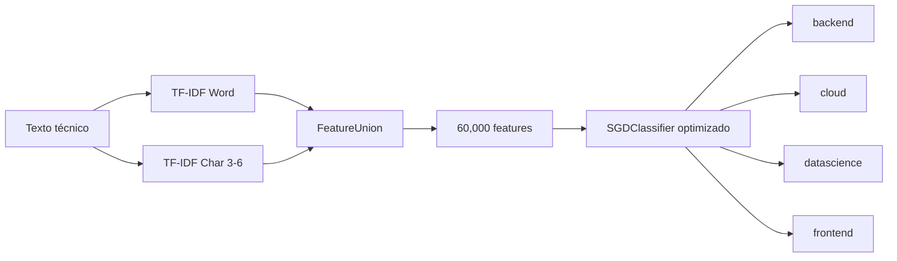

# Arquitectura de TechMind

## Visión general

TechMind es un sistema de clasificación de contenido técnico basado en NLP y Machine Learning.

```text
Datos
  ↓
Preparación y validación
  ↓
Representación textual
  ↓
TF-IDF Word + TF-IDF Char
  ↓
FeatureUnion
  ↓
SGDClassifier
  ↓
Control operacional
  ↓
FastAPI
  ↓
Monitoring
  ↓
Deployment
```

## Arquitectura v1.1.0



### Rama Word

- normalización Unicode;
- stopwords españolas controladas;
- representación TF-IDF;
- hasta 30,000 características.

### Rama Char

- `char_wb`;
- n-gramas de caracteres 3–6;
- hasta 30,000 características.

### Representación total

```text
Word features: 30,000
Char features: 30,000
Total:         60,000
```

### Clasificador

```text
SGDClassifier optimizado
```

Categorías:

- backend
- cloud
- datascience
- frontend

## Control operacional

Los estados posibles son:

- `aceptada`
- `revision`
- `rechazada`

La cobertura se define como:

```text
features_activas_total =
word_features_activas +
char_features_activas
```

Por compatibilidad, `terminos_activos` continúa disponible como alias del total.

## API

FastAPI mantiene la interfaz REST `1.0.0`.

```text
GET  /
GET  /health
GET  /model-info
POST /predict
GET  /docs
GET  /redoc
GET  /openapi.json
```
