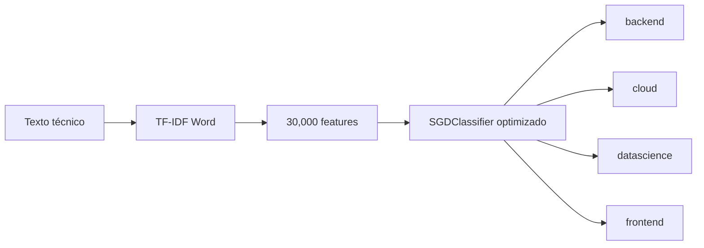

# Arquitectura TechMind v1.0.0

```mermaid
flowchart LR
    A["Texto técnico"] --> B["TF-IDF Word"]
    B --> C["30,000 features"]
    C --> D["SGDClassifier optimizado"]
    D --> E["backend"]
    D --> F["cloud"]
    D --> G["datascience"]
    D --> H["frontend"]
```

Esta versión utilizaba exclusivamente TF-IDF de palabras.
