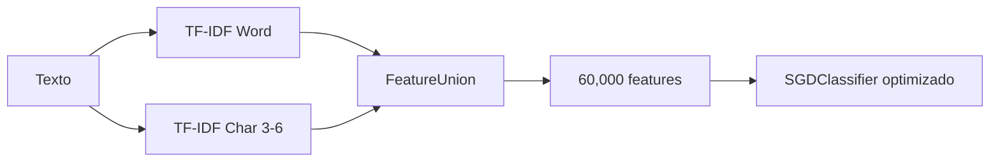

# Arquitectura TechMind v1.1.0


```mermaid
flowchart LR
    A["Texto"] --> B["TF-IDF Word"]
    A --> C["TF-IDF Char 3-6"]
    B --> D["FeatureUnion"]
    C --> D
    D --> E["60,000 features"]
    E --> F["SGDClassifier optimizado"]
```

## Mejora principal

Se incorpora TF-IDF Char para aumentar cobertura y robustez en textos técnicos cortos.

```text
Word: 30,000
Char: 30,000
Total: 60,000
```
